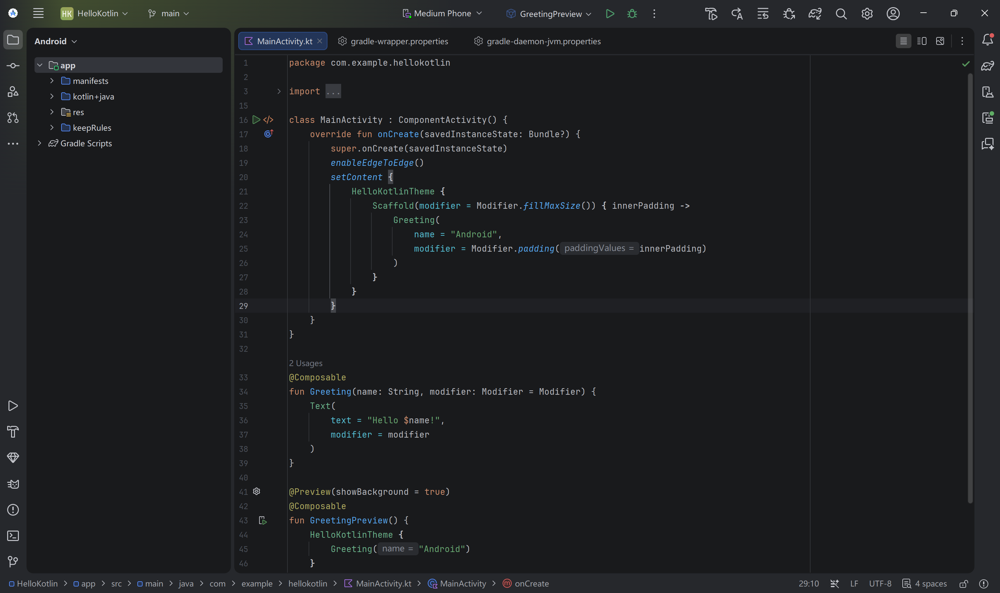
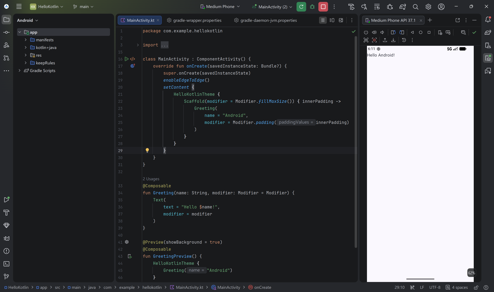
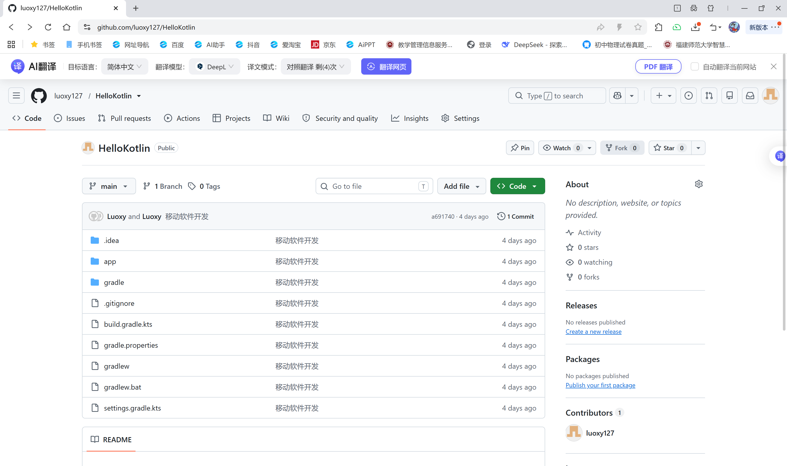

# Android 开发基础实验报告

## 一、实验目的

1. 了解 Android 开发的基本概念与开发流程
2. 掌握 Android Studio 的安装与基本使用
3. 能够独立创建第一个 Android 工程
4. 学会使用 Git 将项目同步到 GitHub/Gitee 远程仓库

## 二、实验环境

| 项目 | 说明 |
| --- | --- |
| 操作系统 | Windows |
| 开发工具 | Android Studio |
| 编程语言 | Kotlin |
| 版本控制 | Git |
| 代码托管 | GitHub |
| 项目名称 | HelloKotlin |

## 三、实验内容

1. 阅读 Android 开发相关预备知识文档
2. 安装 Android Studio 开发环境
3. 创建第一个 Android 工程 HelloKotlin
4. 将项目代码推送到 GitHub 远程仓库

## 四、实验步骤

### 1. 预备知识学习

阅读课程官方博客及 Android 开发者官方文档，了解 Android 开发的基本概念、开发环境搭建方法和常见问题解决方式。

### 2. 安装 Android Studio

从 Android 官网下载 Android Studio 安装包，按照向导完成安装。安装完成后启动软件，等待初始配置完成。

### 3. 创建 Android 工程

打开 Android Studio，选择 **New Project**，选择 **Empty Activity (Compose)** 模板，填写项目名称 `HelloKotlin`、包名 `com.example.hellokotlin`，选择最低 SDK 版本为 API 24，点击 Finish 完成创建。

等待 Gradle 同步完成后，项目自动生成完毕。



### 4. 运行验证

连接 Android 模拟器或真机，点击运行按钮，等待应用构建启动，界面显示 "Hello Android!" 字样，说明项目创建成功。



### 5. 创建 GitHub 远程仓库

登录 GitHub，点击 New repository 创建新仓库，仓库名设为 `HelloKotlin`，不勾选初始化选项，完成创建后获取仓库地址。

### 6. 推送代码到 GitHub

在项目根目录打开终端，执行以下命令：

```bash
git init
git add .
git commit -m "初始化 HelloKotlin 项目"
git remote add origin https://github.com/你的用户名/HelloKotlin.git
git push -u origin master
```

推送成功后，在 GitHub 仓库页面即可看到完整的项目代码。



## 五、实验结果

1. Android Studio 安装完成，可正常启动并配置 SDK
2. 成功创建 HelloKotlin Android 工程，项目结构完整
3. 项目可在模拟器上正常运行，显示默认界面
4. 成功将项目推送到 GitHub 远程仓库，代码可在线查看

## 六、实验总结

通过本次实验，完成了 Android 开发环境的搭建和第一个 Android 工程的创建，初步了解了 Android 项目的目录结构。同时掌握了 Git 的基本使用方法，学会了将本地项目同步到 GitHub 进行版本管理和云端备份。

本次实验是 Android 开发的入门基础，熟悉了从环境搭建到项目运行的完整流程，为后续深入学习 Android 开发打下了基础。
